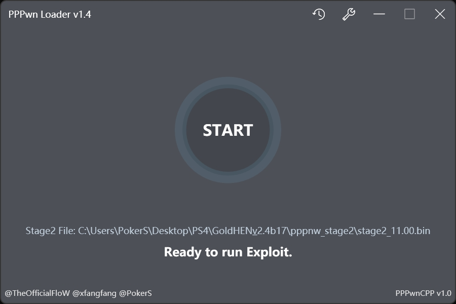
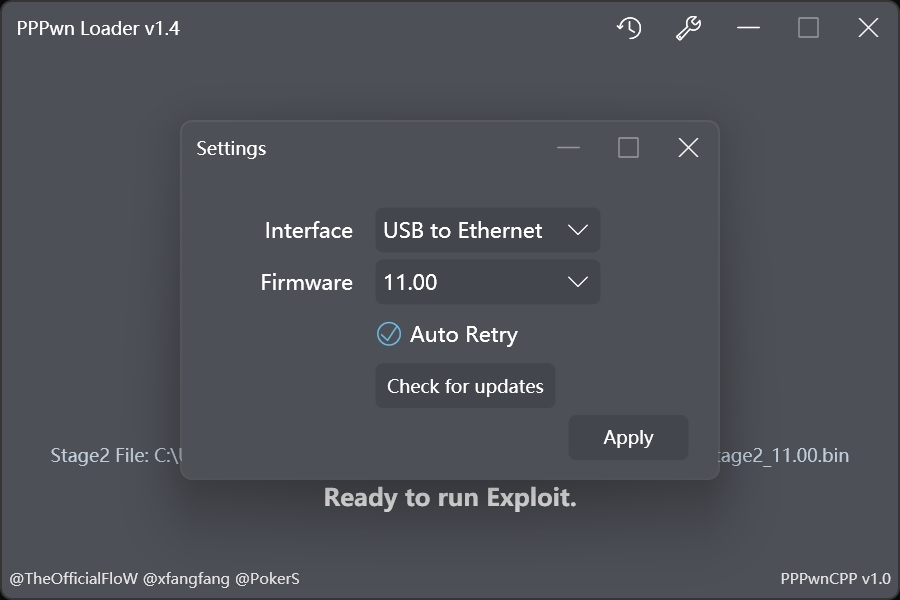
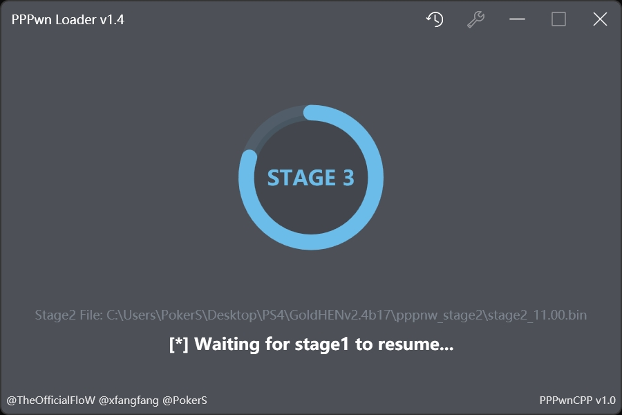
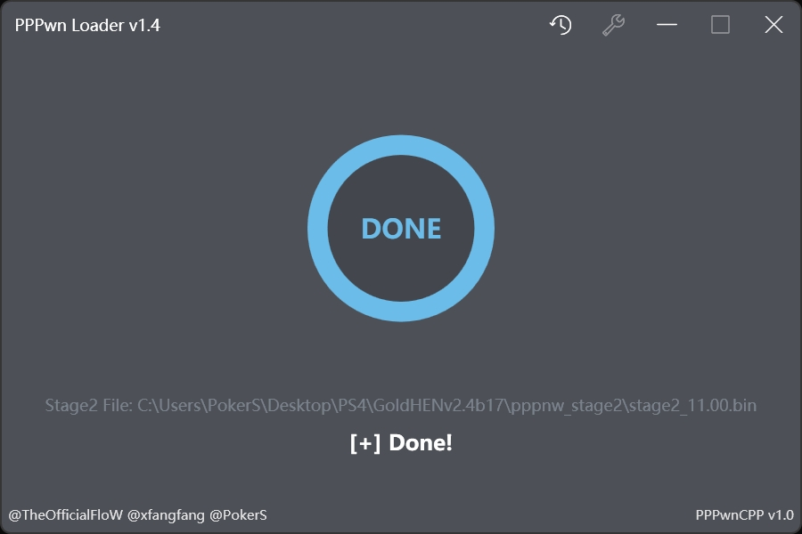
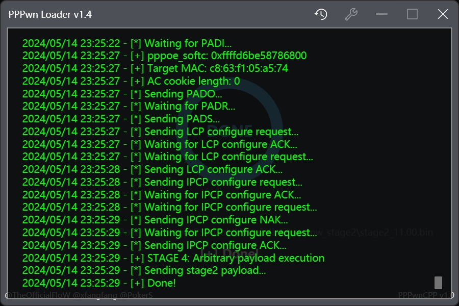

# PPPwn Loader
[中文](README_CN.md)
## Overview
A Windows front-end desktop program based on [PPPwn](https://github.com/TheOfficialFloW/PPPwn) that aims to reduce the environmental dependencies needed to run PPPwn, and implement one-click RCE in the simplest way possible.
## Technology
- NET Framework 4.7.2 based WPF application.
- Interface elements are implemented using [Panuon.WPF.UI](https://github.com/Panuon/Panuon.WPF.UI).
- `PPPwn.exe` in the `PPPwn` folder uses Python scripts from [PPPwn](https://github.com/TheOfficialFloW/PPPwn) generated by [PyInstaller](https://pyinstaller.org), `payload` in the `PPPwn` folder is used for testing the `PPPwn.exe` and `PPPwn.exe` in the `PPPwn` folder. The `stage1.bin` and `stage2.bin` files in the `payload` folder for testing are also compiled from the [PPPwn](https://github.com/TheOfficialFloW/PPPwn) repository.
## Requirements
- A Windows computer (preferably Windows 10 x64 or above)
- A network cable
- A PS4 (system version 7.50 ~ 11.00)
## Use
1. Download the latest build of `PPPwn Loader` from [Release](https://github.com/PokersKun/PPPwn-Loader/releases).
2. Unzip the whole thing and run `PPPwn Loader.exe`, in the first drop down box select the Ethernet port you are connecting to the PS4 (I've tried connecting directly to the PS4 through a cable with better success).
3. Select your PS4's current system version in the second drop-down box (the supported versions in there will change as [PPPwn](https://github.com/TheOfficialFloW/PPPwn) is updated).
4. Click `Select Stage2 File...` Select the `stage2.bin` file you want to load, either from @LightningMods's [PPPwn](https://github.com/LightningMods/PPPwn/releases) branch for various functions, or try using the `stage2.bin` file in the `stage2` folder in the `PPPwn` directory for testing purposes to verify that your PS4 is capable of using the exploit.
5. The `READY` button on the interface should change to a `START` button, and when you click it, you will be prompted with the message `Waiting for PPPoE connection...`.
6. Follow [PPPwn#usage](https://github.com/TheOfficialFloW/PPPwn?tab=readme-ov-file#usage) to open a PPPoE connection on your PS4:
    - Go to `Settings` and then `Network`
    - Select `Set Up Internet connection` and choose `Use a LAN Cable`
    - Choose `Custom` setup and choose `PPPoE` for `IP Address Settings`
    - Enter anything for `PPPoE User ID` and `PPPoE Password`
    - Choose `Automatic` for `DNS Settings` and `MTU Settings`
    - Choose `Do Not Use` for `Proxy Server`
    - Click `Test Internet Connection` to communicate with your computer
7. At this point you will see a change in the `PPPwn Loader` interface, it will start to run PPPwn, please be patient and wait for the result, if it finally shows `Done` it means it was loaded successfully, you will see the result on your PS4.
8. Keep in mind that the success rate of the current exploit is not very high, and if the PPPwn process fails, by default the PPPwn Loader will automatically restart the PPPwn by pressing the `×` on the joystick and then the `○`. If the PPPwn Loader does not respond, please click the `READY` button to stop your PPPwn and restart it, and then the PS4 will also need to click `Test Internet Connection` again.
## Preview

## Acknowledgments
[@TheOfficialFloW](https://github.com/TheOfficialFloW)
[@Mochengvia](https://github.com/Mochengvia)