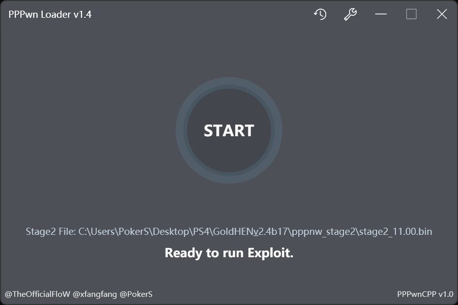
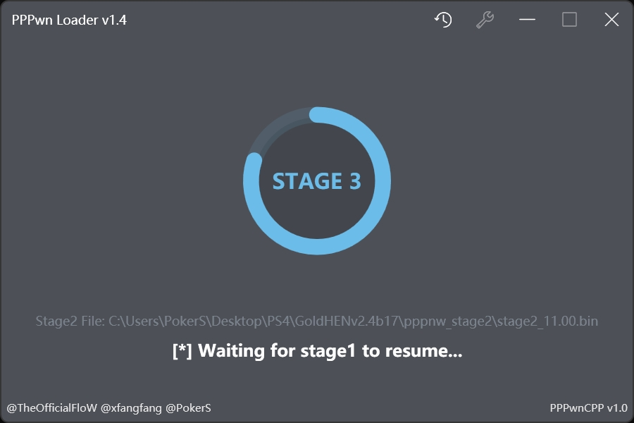
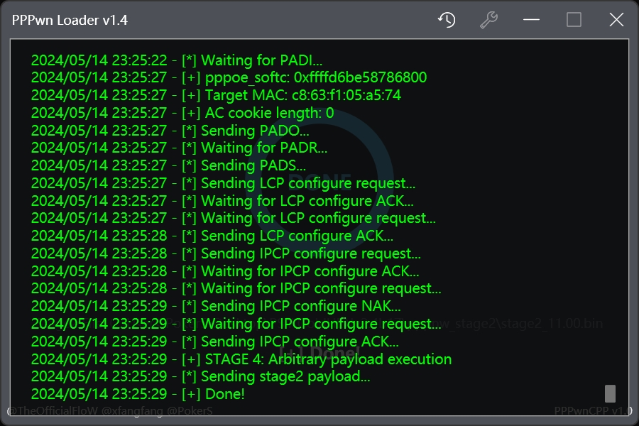

# PPPwn Loader
[English](README.md)
## 概述
一个基于 [PPPwn](https://github.com/TheOfficialFloW/PPPwn) 的 Windows 前端桌面程序，致力于减轻运行 PPPwn 所需要的环境依赖，用最简单的方式实现一键 RCE。
## 技术
- 基于 .NET Framework 4.7.2 所开发的 WPF 应用程序。
- 界面元素采用 [Panuon.WPF.UI](https://github.com/Panuon/Panuon.WPF.UI) 实现。
- `PPPwn` 文件夹下的 `pppwn.exe` 使用了 [PPPwn_cpp](https://github.com/xfangfang/PPPwn_cpp) 的 C++ 重写版本，`payload` 文件夹中用于测试的 `stage1.bin` 和 `stage2.bin` 文件来源于 [PPPwn](https://github.com/TheOfficialFloW/PPPwn) 仓库的源代码所编译生成。
## 需求
- 一台 Windows 电脑（最好 Windows 10 x64 或以上系统）
- 一条网线
- 一台 PS4（系统版本 7.50 ~ 11.00）
## 使用
### 首次使用
1. 从 [Release](https://github.com/PokersKun/PPPwn-Loader/releases) 下载 `PPPwn Loader` 最新的生成版本。
2. 完整解压后运行 `PPPwn Loader.exe`，在第一个下拉框选择选择您连接到 PS4 的以太网口（我试过用通过网线直连 PS4 成功率会更高）。
3. 在第二个下拉框中选择您 PS4 当前的系统版本（里面所支持的版本会随着 [PPPwn](https://github.com/TheOfficialFloW/PPPwn) 的更新而变化）。
4. 点击 `Select Stage2 File...` 选择您所需要加载的 stage2.bin 文件，可以从 [GoldHEN](https://github.com/GoldHEN/GoldHEN/releases) 的仓库获取最新的 stage2.bin 和 goldhen.bin 文件用于注入越狱功能，也可以使用 @LightningMods 的 [PPPwn](https://github.com/LightningMods/PPPwn/releases) 分支获得各种功能的 stage2.bin文件，除此之外也可以尝试使用 `stage2` 文件夹中用于测试的 `stage2.bin` 文件来验证您的 PS4 是否可以使用该漏洞。
5. [可选]将需要加载的 Payload 文件如 `goldhen.bin` 文件放置于 `exFAT/FAT32` 格式的 U 盘中，并插入 PS4 主机上。
6. 界面上的 `READY` 按钮应该会变成 `START` 按钮，此时点击它，会提示 `[*] Waiting for PADI...`。
7. 遵循 [PPPwn#usage](https://github.com/TheOfficialFloW/PPPwn?tab=readme-ov-file#usage) 在 PS4 上打开 PPPoE 连接：
    - 转到 `设定`，然后转到 `网络`
    - 选择 `设定互联网连接`，然后选择 `使用LAN连接线`
    - 选择 `定制` 设定，在 `IP 地址设定` 中选择 `PPPoE`
    - 为 `PPPoE 用户 ID` 和 `PPPoE 密码` 输入任意内容
    - 在 `DNS 设定` 和 `MTU 设定` 中选择 `自动`
    - 在 `Proxy 服务器` 中选择 `不使用`
    - 单击 `测试互联网连接` 与计算机通信
8. 此时您可以看到 `PPPwn Loader` 的界面产生变化，它将开始正式运行 PPPwn，请耐心等待运行结果，如最后显示 "Done" 则表示加载成功，您将会在 PS4 上看到运行结果。
9. 请记住当前漏洞的成功率不是百分百，如 PPPwn 失败，默认已经勾选了 `Auto Retry` 的情况下 PPPwn Loader 会自动重新开始 PPPwn，您**无需**做任何操作只需要等待 PPPwn 自动完成即可（如出现死机，请遵循下面的[二次使用](###二次使用)来重新完成 PPPwn）。
### 二次使用
**注意：如之前已经通过 PPPwn 成功注入 GoldHEN，则无需插入 U 盘**
1. 此时 PS4 未开机，直接打开 PPPwn Loader 并点击 `START` 按钮。
2. 打开 PS4 的电源，自动开始 PPPwn。
3. 等待 PPPwn 完成即可。
## 预览

## 鸣谢
[@TheOfficialFloW](https://github.com/TheOfficialFloW)
[@xfangfang](https://github.com/xfangfang)
[@Mochengvia](https://github.com/Mochengvia)